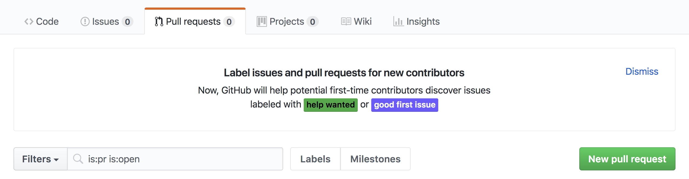

# Maratona Behind the Code 2020


# Sumário
- [Desafios](#desafios)
- [Como contribuir?](#como-contribuir)
- [Licença](#licença)

## Desafios

Quer saber mais sobre os desafios lançados durante a maratona? Click no [link](https://github.com/maratonadev-br) para saber mais sobre os desafios.

## Como contribuir?

1. Para contribuir, você deve dar um *fork* ou *clone* do repositório

    1.1. *Fork*: Use para fazer as alterações diretamente no GitHub! 
    
    

2. Depois de feito o *fork* ou *clone*, você precisa inserir uma pasta com o seu nome, seguindo os passos abaixo:

    2.1. Os `Arquivos.zip` são os mesmo enviados durante a submissão
  
    2.2. O arquivo `README.md` é opcional, mas caso queira fazer, irei deixar um [modelo](./modelo.md) para ser seguido.

```
BTC-2020
└───Desafio #X
    └─── Seu Nome
│   │   │ Arquivos.zip
│   │   │ README.md (Opcional)
```

3. Depois de feito o upload de todos os arquivos acima, você precisa fazer um pull request, seguindo os passos abaixo:

	3.1. Clique no botão para fazer o *pull request*
  
    <a href="https://github.com/esau-morais/BTC-2020/pulls">
      
    </a>
	
	3.2. Clique em "New pull request"
  	
  
	3.3. Então, basta adicionar um comentário falando sobre suas alterações para que seja melhor revisado e clicar em "Create pull request"!
	

## [Licença](./LICENSE)
